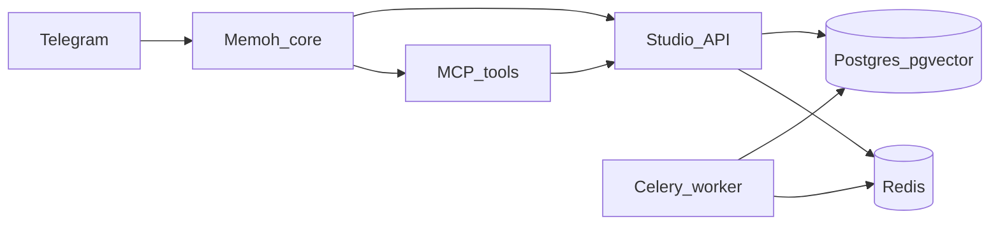

# Архитектура (обзор)

## Компоненты

- **Memoh** — агентное ядро, сценарии, инструменты; не хранилище бизнес-данных.
- **Studio API** (FastAPI) — Event Mirror ingest, REST/MCP-facing API, админка (минимум).
- **Studio Worker + Beat** (Celery) — фоновые задачи: SLA, дайджесты, RAG ingest, очереди.
- **PostgreSQL 16 + pgvector** — чаты, сообщения, сырые updates, RAG chunks, аудит.
- **Redis** — брокер Celery и служебные структуры (очереди/локи по мере реализации).
- **MCP** — инструменты для Memoh: чтение сообщений, дайджесты, знания, задачи, правила и т.д.

## Потоки

- **Event Mirror**: сырые updates и производные сущности — в Studio (идемпотентно).
- **Response Queue**: входящие сообщения/turns сериализуются per-chat; статусы фиксируются в Studio (детали после Фазы 1).

## Границы

- Heartbeat Memoh не кастомизируется под SLA.
- SLA — отдельный монитор в worker/Beat.
