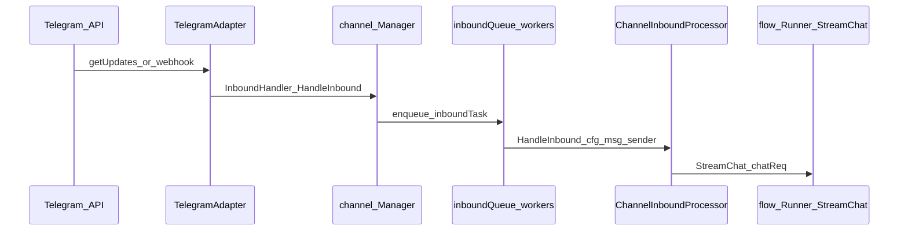

# План внедрения (фазы 0–14)

## Фаза 1 — разведка Memoh (выполнено, код не менялся)

### Telegram adapter

| Что | Где |
|-----|-----|
| Адаптер Telegram (long polling, сбор media group, дедуп `update_id`) | [`internal/channel/adapters/telegram/telegram.go`](internal/channel/adapters/telegram/telegram.go) |
| Тип канала | [`internal/channel/adapters/telegram/descriptor.go`](internal/channel/adapters/telegram/descriptor.go) — `Type = "telegram"` |
| Вход в обработку | В цикле `for update := range updates` вызывается `a.dispatchInbound(...)` — **каждый update в новой goroutine** (`go func() { handler(...) }()`), см. `dispatchInbound` в том же файле. |
| Webhook (альтернатива polling) | [`internal/channel/webhook_handler.go`](internal/channel/webhook_handler.go) — `GET/POST /channels/:platform/webhook/:config_id` → `receiver.HandleWebhook(..., h.manager.HandleInbound, ...)` |

### Путь inbound-сообщения (Telegram → агент)

Упрощённая цепочка:

1. **`TelegramAdapter.dispatchInbound`** — логирует и вызывает `handler(ctx, cfg, msg)` асинхронно.
2. **`channel.Manager.HandleInbound`** ([`internal/channel/inbound.go`](internal/channel/inbound.go)) — кладёт задачу в **`inboundQueue`**; пул из **`inboundWorkers`** горутин вызывает `handleInbound` → `processor.HandleInbound`.
3. **`inbound.ChannelInboundProcessor.HandleInbound`** ([`internal/channel/inbound/channel.go`](internal/channel/inbound/channel.go)) — идентичность, маршрут, сессия, ACL, команды; при триггере ассистента — **`dispatcher` (RouteDispatcher)** для режимов inject/queue/parallel, затем **`p.runner.StreamChat(streamCtx, chatReq)`** (conversation flow + LLM).
4. **JWT для обратных вызовов** в том же файле (~668+): выдаётся токен владельца бота для «downstream calls (MCP tools, schedule, etc.)».

### Уже существующая логика «второе сообщение при активном стриме»

- Компонент: [`internal/channel/inbound/dispatcher.go`](internal/channel/inbound/dispatcher.go) — **`RouteDispatcher`** per `route_id`.
- Режимы текста: **`DetectMode`** — префиксы `/btw` (inject), `/now` (parallel), `/next` (queue); по умолчанию **inject**.
- Если для маршрута уже **`IsActive(routeID)`** и режим не **parallel**:
  - **ModeInject** — сообщение вставляется в активный раунд (`dispatcher.Inject`); при успехе вызывается **`sendModeConfirmation`** с emoji **👀**.
  - **ModeQueue** — **`dispatcher.Enqueue`**, подтверждение **📋**; обработка после **`drainQueue`** по завершении стрима (`MarkDone`).
- Диспетчер создаётся в агенте: [`cmd/agent/app.go`](cmd/agent/app.go) — `processor.SetDispatcher(inbound.NewRouteDispatcher(log))`.

**Вывод по «глазику»:** реакция **👀** — это не «потеря» сообщения, а **явное подтверждение режима inject** (сообщение принято в активный agent stream). Отдельный ответ в чат при этом может не прийти сразу, если ассистент объединяет контекст в одном раунде.

### MCP (инструменты агента)

| Слой | Файлы / назначение |
|------|---------------------|
| gRPC MCP к workspace бота | [`internal/workspace/manager.go`](internal/workspace/manager.go) — `MCPClient`, контейнеры `mcp-` |
| Шлюз federated MCP (list/call tools) | [`internal/mcp/tool_gateway_service.go`](internal/mcp/tool_gateway_service.go) |
| Провайдеры инструментов агента | [`internal/agent/tools/federation.go`](internal/agent/tools/federation.go) (обёртка `mcp.ToolSource`), [`internal/agent/tools/container.go`](internal/agent/tools/container.go), `memory.go`, `browser.go` и др. — вызовы `MCPClient` |
| HTTP для MCP | [`internal/handlers/mcp_tools.go`](internal/handlers/mcp_tools.go) (точки API — см. регистрацию в роутере при необходимости в Фазе 3) |

Связка Studio ↔ Memoh для **кастомных** MCP-инструментов студии: отдельный MCP-сервер студии + регистрация в Memoh как federated source (детали в Фазе 3+).

---

## Фаза 2 — Response Queue (Studio, без Memoh)

### Статус: безопасная часть 2a (выполнено)

Реализация **только** в [`studio/pb_studio/response_queue/`](studio/pb_studio/response_queue/): модели SQLAlchemy, сервис `QueueService`, Pydantic-контракт `InboundEnqueue` / `TurnProcessor`, SQL-скелет [`studio/migrations/001_response_queue.sql`](studio/migrations/001_response_queue.sql). **Без** правок Memoh, **без** Telegram runtime, **без** Event Mirror.

| Компонент | Назначение |
|-----------|------------|
| `statuses.TurnStatus` | `pending`, `debounced`, `processing`, `answered`, `ignored_by_policy`, `failed_with_error`, `cancelled_by_newer_request` |
| `models.ResponseTurn` | Один turn (склейка текста, глобальный `sequence_number` для fair dispatch между чатами, per-chat FIFO через блокировки и проверку «ниже по seq») |
| `models.InboundMessage` | Строка входа + **`dedupe_key`** UNIQUE |
| `service.QueueService` | `enqueue`, `flush_due_turns`, `dispatch_next` (FOR UPDATE SKIP LOCKED), `cancel_pending_turn`; debounce **2–4 с** (по умолчанию 2.5 с) |
| `schemas` | Контракт входа и `TurnProcessor` для воркера (позже вызов Memoh) |

Тесты: `studio/tests/test_response_queue.py` (10 сценариев). Локально без Python: `docker run --rm -v .../studio:/app -w /app python:3.12-slim bash -c "pip install -e '.[dev]' && pytest tests/"`.

### Не сделано в 2a (следующие подфазы)

- Celery beat / Redis consumer, HTTP FastAPI-оболочка Studio (часть Фазы 3 может объединить).
- Подключение к Memoh (варианты A/B/C — только после явного решения в `docs/06_DECISIONS.md`).
- Event Mirror (Фаза 4).

**Интеграция с Memoh (после 2a):** Event Mirror как источник строк для `enqueue`; Celery/воркер вызывает `TurnProcessor` → Memoh по варианту A/B/C из [`docs/06_DECISIONS.md`](docs/06_DECISIONS.md). Тесты Memoh для своего dispatcher: [`internal/channel/inbound/dispatcher_test.go`](internal/channel/inbound/dispatcher_test.go).

---

## Оглавление фаз (0–14)

| Фаза | Содержание |
|------|------------|
| 0 | Bootstrap: Memoh + каркас `studio/`, docs, memory-bank, rules, compose studio-infra |
| 1 | Техническая разведка Memoh (Telegram, MCP, «глазик») — этот документ (секция выше) |
| 2 | Response Queue Studio: модели + `QueueService` + тесты (2a); интеграция Memoh / Celery / HTTP — дальше |
| 3 | Studio skeleton: FastAPI, Postgres, Redis, Celery, Alembic, `/health`, compose |
| 4 | Event Mirror: raw updates, chats/messages, lifecycle |
| 5 | Управляющая группа, роли, уведомления только туда |
| 6 | Сводка «сегодня» из Studio DB |
| 7 | Сводки из управляющей группы (чат / проект / все), права |
| 8 | SLA (код, не GPT), рабочие часы, антиспам, mute |
| 9 | Проекты: bind/list/digest |
| 10 | База знаний: Docling, embeddings, pgvector |
| 11 | Правила: save/list/disable/audit |
| 12 | Импорт истории Telegram Desktop JSON |
| 13 | Studio Admin (HTMX/Jinja/Bootstrap) |
| 14 | Prod compose, Caddy, runbook, backup (деплой только с подтверждением) |
