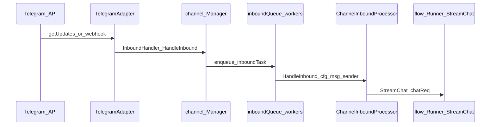

# План внедрения (фазы 0–14)

## Фаза 1 — разведка Memoh (выполнено, код не менялся)

### Telegram adapter

| Что | Где |
|-----|-----|
| Адаптер Telegram (long polling, сбор media group, дедуп `update_id`) | [`internal/channel/adapters/telegram/telegram.go`](internal/channel/adapters/telegram/telegram.go) |
| Тип канала | [`internal/channel/adapters/telegram/descriptor.go`](internal/channel/adapters/telegram/descriptor.go) — `Type = "telegram"` |
| Вход в обработку | В цикле `for update := range updates` вызывается `a.dispatchInbound(...)` — **каждый update в новой goroutine** (`go func() { handler(...) }()`), см. `dispatchInbound` в том же файле. |
| Webhook (альтернатива polling) | [`internal/channel/webhook_handler.go`](internal/channel/webhook_handler.go) — `GET/POST /channels/:platform/webhook/:config_id` → `receiver.HandleWebhook(..., h.manager.HandleInbound, ...)` |

### Путь inbound-сообщения (Telegram → агент)

Упрощённая цепочка:

1. **`TelegramAdapter.dispatchInbound`** — логирует и вызывает `handler(ctx, cfg, msg)` асинхронно.
2. **`channel.Manager.HandleInbound`** ([`internal/channel/inbound.go`](internal/channel/inbound.go)) — кладёт задачу в **`inboundQueue`**; пул из **`inboundWorkers`** горутин вызывает `handleInbound` → `processor.HandleInbound`.
3. **`inbound.ChannelInboundProcessor.HandleInbound`** ([`internal/channel/inbound/channel.go`](internal/channel/inbound/channel.go)) — идентичность, маршрут, сессия, ACL, команды; при триггере ассистента — **`dispatcher` (RouteDispatcher)** для режимов inject/queue/parallel, затем **`p.runner.StreamChat(streamCtx, chatReq)`** (conversation flow + LLM).
4. **JWT для обратных вызовов** в том же файле (~668+): выдаётся токен владельца бота для «downstream calls (MCP tools, schedule, etc.)».

### Уже существующая логика «второе сообщение при активном стриме»

- Компонент: [`internal/channel/inbound/dispatcher.go`](internal/channel/inbound/dispatcher.go) — **`RouteDispatcher`** per `route_id`.
- Режимы текста: **`DetectMode`** — префиксы `/btw` (inject), `/now` (parallel), `/next` (queue); по умолчанию **inject**.
- Если для маршрута уже **`IsActive(routeID)`** и режим не **parallel**:
  - **ModeInject** — сообщение вставляется в активный раунд (`dispatcher.Inject`); при успехе вызывается **`sendModeConfirmation`** с emoji **👀**.
  - **ModeQueue** — **`dispatcher.Enqueue`**, подтверждение **📋**; обработка после **`drainQueue`** по завершении стрима (`MarkDone`).
- Диспетчер создаётся в агенте: [`cmd/agent/app.go`](cmd/agent/app.go) — `processor.SetDispatcher(inbound.NewRouteDispatcher(log))`.

**Вывод по «глазику»:** реакция **👀** — это не «потеря» сообщения, а **явное подтверждение режима inject** (сообщение принято в активный agent stream). Отдельный ответ в чат при этом может не прийти сразу, если ассистент объединяет контекст в одном раунде.

### MCP (инструменты агента)

| Слой | Файлы / назначение |
|------|---------------------|
| gRPC MCP к workspace бота | [`internal/workspace/manager.go`](internal/workspace/manager.go) — `MCPClient`, контейнеры `mcp-` |
| Шлюз federated MCP (list/call tools) | [`internal/mcp/tool_gateway_service.go`](internal/mcp/tool_gateway_service.go) |
| Провайдеры инструментов агента | [`internal/agent/tools/federation.go`](internal/agent/tools/federation.go) (обёртка `mcp.ToolSource`), [`internal/agent/tools/container.go`](internal/agent/tools/container.go), `memory.go`, `browser.go` и др. — вызовы `MCPClient` |
| HTTP для MCP | [`internal/handlers/mcp_tools.go`](internal/handlers/mcp_tools.go) (точки API — см. регистрацию в роутере при необходимости в Фазе 3) |

Связка Studio ↔ Memoh для **кастомных** MCP-инструментов студии: отдельный MCP-сервер студии + регистрация в Memoh как federated source (детали в Фазе 3+).

---

## Фаза 2 — Response Queue (Studio, без Memoh)

### Статус: безопасная часть 2a (выполнено)

Реализация **только** в [`studio/pb_studio/response_queue/`](studio/pb_studio/response_queue/): модели SQLAlchemy, сервис `QueueService`, Pydantic-контракт `InboundEnqueue` / `TurnProcessor`, SQL-скелет [`studio/migrations/001_response_queue.sql`](studio/migrations/001_response_queue.sql). **Без** правок Memoh, **без** Telegram runtime, **без** Event Mirror.

| Компонент | Назначение |
|-----------|------------|
| `statuses.TurnStatus` | `pending`, `debounced`, `processing`, `answered`, `ignored_by_policy`, `failed_with_error`, `cancelled_by_newer_request` |
| `models.ResponseTurn` | Один turn (склейка текста, глобальный `sequence_number` для fair dispatch между чатами, per-chat FIFO через блокировки и проверку «ниже по seq») |
| `models.InboundMessage` | Строка входа + **`dedupe_key`** UNIQUE |
| `service.QueueService` | `enqueue`, `flush_due_turns`, `dispatch_next` (FOR UPDATE SKIP LOCKED), `cancel_pending_turn`; debounce **2–4 с** (по умолчанию 2.5 с) |
| `schemas` | Контракт входа и `TurnProcessor` для воркера (позже вызов Memoh) |

Тесты: `studio/tests/test_response_queue.py` (10 сценариев). Локально без Python: `docker run --rm -v .../studio:/app -w /app python:3.12-slim bash -c "pip install -e '.[dev]' && pytest tests/"`.

### Не сделано в 2a (следующие подфазы)

- Celery beat / Redis consumer, HTTP FastAPI-оболочка Studio (часть Фазы 3 может объединить).
- Подключение к Memoh (варианты A/B/C — только после явного решения в `docs/06_DECISIONS.md`).
- Event Mirror (Фаза 4) — см. подфазу **4a** ниже.

**Интеграция с Memoh (после 2a):** Event Mirror как источник строк для `enqueue`; Celery/воркер вызывает `TurnProcessor` → Memoh по варианту A/B/C из [`docs/06_DECISIONS.md`](docs/06_DECISIONS.md). Тесты Memoh для своего dispatcher: [`internal/channel/inbound/dispatcher_test.go`](internal/channel/inbound/dispatcher_test.go).

---

## Фаза 4a — Event Mirror в Studio (без Memoh, без Telegram outbound)

**Статус:** реализовано в [`studio/pb_studio/event_mirror/`](studio/pb_studio/event_mirror/) + `POST /events/telegram`.

| Компонент | Назначение |
|-----------|------------|
| `POST /events/telegram` | Принимает **сырой JSON** Telegram `Update`; минимальная валидация (`update_id` int); идемпотентность по `update_id`; ответ `TelegramEventIngestResponse`. |
| `studio_telegram_raw_updates` | Полный payload JSON. |
| `studio_chats` / `studio_telegram_users` / `studio_messages` | Нормализованные сущности (upsert по `telegram_chat_id`, `telegram_user_id`, `(chat_id, telegram_message_id)`). |
| `studio_chat_lifecycle_events` | `message` / `edited_message` / `my_chat_member` / `chat_member` / `callback_query` / миграции / `new_chat_members` / `left_chat_member` / смена title/photo и др. |
| `studio_audit_log` | `event_mirror.ingest`, `event_mirror.duplicate`, `event_mirror.unsupported_shape`. |
| Alembic `002_event_mirror` | Явный DDL таблиц; `001_initial` переписан на явный DDL очереди (без `create_all` в миграции). |

**Опциональная очередь (Response Queue):** по умолчанию `STUDIO_MIRROR_ENQUEUE_USER_MESSAGES=false` — в БД очереди **ничего не пишется**. Если `true`, после успешной нормализации **только** для обычного пользовательского `message` / `edited_message` с непустым `text`/`caption`, `from.is_bot == false`, `chat.type` ∈ {`private`,`group`,`supergroup`}, вызывается `QueueService.enqueue` с полями из [`pb_studio.response_queue.schemas.InboundEnqueue`](studio/pb_studio/response_queue/schemas.py) (`telegram_chat_id`, `body_text`, `telegram_message_id`, `sender_id`, `raw_payload`). Это **не** вызывает Memoh и **не** шлёт сообщения в Telegram.

**Контракт зеркала → очередь (документированный):** см. `pb_studio.event_mirror.schemas.MirrorQueueContract` (зеркало Pydantic к `InboundEnqueue` для будущих адаптеров).

**Безопасность ingest:** при `STUDIO_EVENTS_INGEST_TOKEN` в окружении эндпоинт требует `Authorization: Bearer <token>`.

**Тесты:** `studio/tests/test_event_mirror.py`.

---

## Фаза 4b — Memoh → Studio Event Mirror (вариант **C**, минимальный hook)

**Статус:** реализовано в Memoh (тонкий слой без второго бота, без смены webhook/getUpdates, без бизнес-логики).

| Что | Где |
|-----|-----|
| Точка зеркала | После дедупа `update_id` в [`internal/channel/adapters/telegram/telegram.go`](internal/channel/adapters/telegram/telegram.go) — копия `Update` уходит в `mirrorTelegramUpdateToStudioAsync` **до** веток callback/message. |
| HTTP POST + env | [`internal/channel/adapters/telegram/studio_event_mirror.go`](internal/channel/adapters/telegram/studio_event_mirror.go): `STUDIO_EVENTS_URL` (полный URL, например `http://127.0.0.1:8000/events/telegram`), Bearer из `MEMOH_STUDIO_EVENTS_TOKEN` или `STUDIO_EVENTS_INGEST_TOKEN`, `MEMOH_TELEGRAM_EVENT_MIRROR_ENABLED`, `MEMOH_TELEGRAM_EVENT_MIRROR_TIMEOUT_MS`, горутина + `recover`, короткий timeout. |
| Response Queue | Memoh **не** включает очередь; в Studio по-прежнему только `STUDIO_MIRROR_ENQUEUE_USER_MESSAGES=true`. |

**Тесты:** `internal/channel/adapters/telegram/studio_event_mirror_test.go` (`go test ./internal/channel/adapters/telegram/...`).

ADR (A/B/C) — в [`docs/06_DECISIONS.md`](docs/06_DECISIONS.md); для транспорта raw Update утверждён и реализован **вариант C**.

---

## Фаза 5 — управляющая группа (Studio, без Memoh, без исходящего Telegram в 5a)

**Статус:** модели, Alembic `003_control_group`, API, интеграция с Event Mirror для `my_chat_member`, тесты `studio/tests/test_control_group.py`. **Исходящих** сообщений в Telegram в этой подфазе **нет** — только БД + политика доставки (`delivery_policy`); реальная отправка в управляющую группу — отдельный шаг (без второго бота, без смены polling/webhook; при необходимости нового Memoh-hook — ADR).

| Компонент | Назначение |
|-----------|------------|
| `studio_chats.chat_role` | Текущая роль: `unknown`, `control_group`, `client_chat`, `project_chat`, `internal_chat`, `service_chat`. |
| `studio_control_groups` | Назначение управляющей группы; не более одной активной записи (partial unique + логика сервиса). |
| `studio_chat_roles` | История назначений ролей (append-only). |
| `studio_system_notifications` | Системные уведомления по событиям (напр. `my_chat_member`); статусы включая `logged_only`, `pending_for_control_group_delivery`, `delivered_to_control_group`, `failed_retryable`, `failed_permanent`; **не** адресуются исходному клиентскому чату. |
| `GET /control-group`, `POST /control-group/set`, `GET /chats`, `GET /chats/unassigned`, `POST /chats/{uuid}/role` | Админ-API; при `STUDIO_ADMIN_TOKEN` — обязательный Bearer. |
| **5b** `sendMessage`, Celery `deliver_pending_system_notifications`, `GET/POST /notifications/system*` | Исходящая доставка только в control group; см. `docs/06_DECISIONS.md` (фаза 5b). |
| Audit | `control_group.set`, `control_group.chat_role_changed`, `control_group.system_notification_created`, события доставки 5b. |
| Event Mirror | После нормализации `my_chat_member` создаётся запись `studio_system_notifications` с `payload.delivery_policy = control_group_only`. |

**Тесты:** `pytest tests/test_control_group.py`; полный набор Studio — `pytest tests/`.

---

## Фаза 6a — сводки: хранение и планировщик (без LLM, без Telegram)

**Статус:** `studio/pb_studio/summaries/`, Alembic `005_chat_summaries`, планировщик `plan_summary_job` / `plan_daily_chat_summaries`, админ-роуты `GET /summaries`, `POST /summaries/plan`, `GET /summaries/{id}`, Celery `plan_daily_chat_summaries`. **Без** Memoh, **без** LLM, **без** генерации текста и **без** отправки сводок в Telegram.

| Компонент | Назначение |
|-----------|------------|
| `studio_chat_summaries` | Задания сводок: тип `daily`/`weekly`/`manual`, период, статус `pending`/`generated`/`failed`, `source_event_count`, опционально `summary_text` / `metadata_json`. |
| `summaries/planner.py` | Подсчёт событий из Event Mirror; создание pending job без дубликата по периоду. |
| Celery `plan_daily_chat_summaries` | Pending daily jobs за вчера (UTC) по всем `studio_chats`. |

**Тесты:** `studio/tests/test_summaries_phase6a.py`.

---

## Фаза 6b — сводки: шаблонная генерация текста (без LLM API, без Telegram)

**Статус:** `summaries/generator.py` — детерминированный текст из `studio_messages` + `studio_chat_lifecycle_events`; обновление `studio_chat_summaries` (`generated` / `failed`); флаг `STUDIO_SUMMARY_GENERATION_ENABLED`; Celery `generate_pending_chat_summaries`; админ `POST /summaries/generate-pending`, `POST /summaries/{id}/generate`. **Без** Memoh, **без** внешних LLM HTTP, **без** `sendMessage` сводок.

| Компонент | Назначение |
|-----------|------------|
| `summaries/generator.py` | Батч pending → шаблон `summary_text`, пустой период — фиксированная строка; ошибка одной строки не отменяет батч. |
| Celery `generate_pending_chat_summaries` | Идемпотентно обрабатывает только `pending`. |
| Env | `STUDIO_SUMMARY_MAX_SOURCE_MESSAGES`, `STUDIO_SUMMARY_MAX_BULLETS` |

**Тесты:** `studio/tests/test_summaries_phase6b.py`.

---

## Фаза 6c — сводки: продуктовый API «сегодня / вчера / период» (без LLM, без Telegram send)

**Статус:** `summaries/product.py` + админ-роуты `POST /summaries/chat/{studio_chat_id}/today|yesterday|period`, `GET /summaries/chat/{studio_chat_id}/latest`. Используются только `plan_summary_job` + `apply_generation_to_row` (шаблон 6b); периоды **today/yesterday** в UTC через `utc_day_bounds`; **manual** для произвольного периода. Идемпотентность: существующая `generated` — возврат; `pending` — догенерация; `failed` за тот же период — **409**. Требуется `STUDIO_SUMMARY_GENERATION_ENABLED=true`. **Без** Memoh, **без** внешнего LLM, **без** `sendMessage` сводок, **без** второго бота и без изменений polling/webhook.

| Компонент | Назначение |
|-----------|------------|
| `summaries/product.py` | `ensure_chat_summary_for_period`, `get_latest_generated_for_chat`, `utc_today_period` / `utc_yesterday_period` |
| `summaries/schemas.py` | `ChatSummaryProductOut`, `PeriodSummaryBody` |
| `api/routes/summaries.py` | Продуктовые эндпоинты перед `GET /summaries/{summary_id}` |
| `docker-compose.local.yml` | Проброс `STUDIO_SUMMARY_*` в `studio-api` и `studio-worker` (хвост 6b для compose) |

**Тесты:** `studio/tests/test_summaries_phase6c.py`.

---

## Фаза 6d — сводки: доставка `generated` в Telegram control group

**Статус:** поля доставки в `studio_chat_summaries` (Alembic `006_summary_delivery_control_group`), `summaries/summary_delivery.py`, `telegram_send_message` возвращает `telegram_message_id` при `ok`; флаги `STUDIO_SUMMARY_DELIVERY_ENABLED`, `STUDIO_SUMMARY_DELIVERY_MAX_RETRIES`; админ `POST /summaries/{id}/deliver-control-group`, `POST /summaries/deliver-pending`, опционально `GET /summaries?delivery_status=`; Celery `deliver_pending_chat_summaries`. Только активная control group, роль destination `control_group`, отказ если исходный чат сводки совпадает с destination; **без** Memoh, **без** LLM/RAG, **без** второго бота, **без** polling/webhook Studio.

| Компонент | Назначение |
|-----------|------------|
| `summaries/constants.py` | `SummaryDeliveryStatus` |
| `summaries/summary_delivery.py` | `try_deliver_summary_row`, батч, форматирование текста |
| `api/routes/summaries.py` | deliver endpoints, фильтр `delivery_status` |
| `docker-compose.local.yml` | Проброс `STUDIO_SUMMARY_DELIVERY_*` в api/worker |

**Тесты:** `studio/tests/test_summaries_phase6d.py`; изоляция env в `tests/conftest.py`.

---

## Фаза 7a — команды сводок из control group (Event Mirror → scan → product → sendMessage)

**Статус:** таблица `studio_control_commands` (Alembic `007_studio_control_commands`), пакет `pb_studio/control_commands/` (parser, service), скан только **активной** control group по `studio_messages` (без client/project/internal/service как источника команд), ответы только `sendMessage` в control group; переиспользование `summaries/product.py` и при включённом флаге — `deliver_summary_to_control_group_by_id` (6d). Флаги `STUDIO_CONTROL_COMMANDS_ENABLED`, `STUDIO_CONTROL_COMMANDS_MAX_BATCH`; Celery `process_control_group_summary_commands`; админ `GET /control-commands`, `POST /control-commands/process-pending`. **Без** Memoh, **без** второго бота, **без** polling/webhook Studio, **без** LLM/RAG/SLA/проектов/Studio Admin UI.

| Компонент | Назначение |
|-----------|------------|
| `control_commands/models.py` | `StudioControlCommand`, уникальности по `source_message_id` / `source_update_id` |
| `control_commands/parser.py` | `/summary_today|yesterday|period|latest|help|chats|all_today|all_yesterday` (7b расширение), валидация UUID и дат |
| `control_commands/service.py` | scan mirror, `begin_nested` при дублях, batch-обработка pending |
| `api/routes/control_commands.py` | админ-эндпоинты |
| `worker/tasks.py` | `process_control_group_summary_commands` |
| `docker-compose.local.yml` | проброс `STUDIO_CONTROL_COMMANDS_*` в api/worker |

**Тесты:** `studio/tests/test_control_commands_phase7a.py` (включая UX/ACL 7b).

---

## Фаза 7b — UX команд сводок и ACL в control group

**Статус:** команды `/summary_chats`, `/summary_all_today`, `/summary_all_yesterday`; обновлён `/summary_help`; список чатов без активной control group с обрезкой длины; «все чаты» — один агрегированный ответ в control group с безопасным обрезанием; `STUDIO_CONTROL_COMMANDS_ALLOWED_USER_IDS` (CSV Telegram user id, пусто = все); статус `failed_access_denied`, отказ в Telegram, аудит `control_commands.access_denied` без токена; `GET /control-commands` — фильтры `status`, `command_name`; `last_error` при общих ошибках через `redact_secrets`. **Без** Memoh, второго бота, polling/webhook Studio, LLM/RAG/SLA/проектов/Studio Admin.

| Компонент | Назначение |
|-----------|------------|
| `control_commands/constants.py` | Лимиты текста, `SUMMARY_HELP_TEXT`, статус `failed_access_denied` |
| `control_commands/service.py` | ACL, `_build_summary_chats_text`, агрегат all today/yesterday |
| `core/config.py` | `studio_control_commands_allowed_user_ids`, `studio_control_commands_allowed_user_ids_set` |
| `api/routes/control_commands.py` | query `command_name` |
| `docker-compose.local.yml`, `.env.example` | `STUDIO_CONTROL_COMMANDS_ALLOWED_USER_IDS` |

**Тесты:** расширение `studio/tests/test_control_commands_phase7a.py`.

---

## Фаза 8a — SLA-инфраструктура по чатам (Studio DB, Event Mirror, без LLM)

**Статус:** таблицы `studio_sla_policies`, `studio_sla_incidents` (Alembic `008_studio_sla`); пакет `pb_studio/sla/` (модели, детектор, сервис, схемы); детектор по `studio_messages` только для `client_chat` / `project_chat`: последнее входящее пользовательское сообщение без последующего ответа бота и просрочка `first_response_minutes` → инцидент `open` / `breached`; без дубликата `(chat_id, trigger_message_id)` при `open`; ответ бота после триггера → `resolved`; уведомления только в активную control group (`sendMessage`, лимит `STUDIO_SLA_MAX_NOTIFICATIONS_PER_INCIDENT`, опционально `followup_minutes` из policy); ошибки Telegram не прерывают цикл; `last_error` через `redact_secrets`. Флаги `STUDIO_SLA_ENABLED`, `STUDIO_SLA_DEFAULT_FIRST_RESPONSE_MINUTES`, `STUDIO_SLA_MAX_NOTIFICATIONS_PER_INCIDENT`; Celery `detect_sla_incidents`; админ `GET/POST /sla/...`. **Без** Memoh, второго бота, polling/webhook Studio, LLM/RAG/проектов/Studio Admin UI.

| Компонент | Назначение |
|-----------|------------|
| `sla/models.py` | `StudioSlaPolicy`, `StudioSlaIncident` |
| `sla/detector.py` | `run_sla_detection_cycle`, разрешение по ответу бота / superseded tail |
| `sla/service.py` | список инцидентов, policies, ack/resolve |
| `api/routes/sla.py` | REST под `STUDIO_ADMIN_TOKEN` |
| `worker/tasks.py` | `detect_sla_incidents` |

**Тесты:** `studio/tests/test_sla_phase8a.py`.

---

## Фаза 8b — рабочие часы и mute для SLA (Studio DB, без LLM)

**Статус:** расширение `studio_sla_policies` (Alembic `009_studio_sla_working_hours`): `timezone` (IANA), `working_days_json`, `working_hours_start` / `working_hours_end`, `holidays_json`, `is_muted`, `muted_until`, `mute_reason`; утилита `sla/calendar.py` — `calculate_due_at(message_time, policy, settings)` при `STUDIO_SLA_WORKING_HOURS_ENABLED=false` эквивалентна 8a; при `true` — дедлайн только в рабочих минутах, старт с ближайшего окна если сообщение вне графика/выходной/праздник; детектор использует `calculate_due_at`; новые инциденты не создаются при `is_muted` или `muted_until > now`; открытые инциденты не трогаются; API `PATCH /sla/policies/{id}`, `POST .../mute`, `POST .../unmute`; env `STUDIO_SLA_DEFAULT_TIMEZONE`, `STUDIO_SLA_WORKING_HOURS_ENABLED`. **Без** Memoh, LLM/RAG/проектов/Studio Admin.

| Компонент | Назначение |
|-----------|------------|
| `sla/calendar.py` | `calculate_due_at`, `policy_blocks_new_incidents` |
| `sla/detector.py` | интеграция календаря и mute |
| `sla/service.py` | mute/unmute/patch policy |
| `api/routes/sla.py` | новые эндпоинты |

**Тесты:** `studio/tests/test_sla_calendar.py`, `studio/tests/test_sla_phase8b.py`.

---

## Фаза 8c — антиспам и rate-limit SLA-уведомлений (Studio DB, без LLM)

**Статус:** таблица `studio_sla_notification_events` (Alembic `010_studio_sla_notification_events`); поля инцидента `next_notification_at`, `suppressed_notification_count`, `last_notification_reason`; модуль `sla/notifications.py` — планирование уведомлений, digest за один цикл детектора (один `sendMessage` на несколько open-инцидентов), cooldown `STUDIO_SLA_NOTIFICATION_COOLDOWN_MINUTES` с учётом `max(cooldown, policy.followup_minutes)` при заданном followup; обрезка текста `STUDIO_SLA_NOTIFICATION_TEXT_MAX_LEN`; события `sent` / `suppressed` / `failed` в audit-таблице; ошибки Telegram не валят детектор; токен не попадает в `payload_json` / `error` / `last_error` (через `redact_secrets` / `_safe_payload`). Env: `STUDIO_SLA_NOTIFICATION_DIGEST_MAX_ITEMS`. API: `GET /sla/notification-events`, `POST /sla/incidents/{id}/notify`, фильтры `severity` / `chat_id` на `GET /sla/incidents`; счётчики в ответе `POST /sla/detect`. **Без** Memoh, второго бота, polling/webhook Studio, LLM/RAG/проектов/Studio Admin UI.

**Тесты:** `studio/tests/test_sla_phase8c.py`, регрессия `test_sla_phase8a.py`.

---

## Фаза 9a — проекты в Studio (модель + привязка чатов, без RAG/LLM)

**Статус:** таблицы `studio_projects`, `studio_project_chats` (Alembic `011_studio_projects`); пакет [`studio/pb_studio/projects/`](studio/pb_studio/projects/); админ-API `GET/POST/PATCH /projects`, `POST /projects/{id}/archive`, `POST .../bind-chat`, `unbind-chat`, `GET .../chats` под `STUDIO_ADMIN_TOKEN` (как остальные админ-роуты). Команды Telegram `/project_*` — тот же Event Mirror + `run_control_commands_standalone` (Celery: `process_control_group_summary_commands` без изменений + алиас `process_control_group_commands`). ACL: `STUDIO_CONTROL_COMMANDS_ALLOWED_USER_IDS`; ответы только в активную control group; bind может выставить `chat_role=project_chat` для `unknown`/`client_chat`; нельзя привязать active control group и чаты с ролью `control_group`; `unbind` только `is_active=false`. **Без** Memoh, второго бота, polling/webhook Studio, LLM/RAG/digest, Studio Admin UI.

**Тесты:** [`studio/tests/test_projects_phase9a.py`](studio/tests/test_projects_phase9a.py); регрессия control commands / Celery.

---

## Фаза 9b — project digest из chat summaries (Studio DB, без LLM/RAG)

**Статус:** таблица `studio_project_digests` (Alembic `012_studio_project_digests`); пакет [`studio/pb_studio/project_digests/`](studio/pb_studio/project_digests/) (models/schemas/service/delivery); генерация из активных `studio_project_chats` + существующий пайплайн `summaries/product.py` (получить/создать summary, при `pending` — сгенерировать; `failed` summary не валит digest — фиксируется в `metadata_json`); `digest_text` — детерминированный шаблон (проект, период UTC, список чатов с кратким `summary_text`); пустой проект активных чатов → `generated` с текстом «У проекта нет активных чатов.»; уникальность `(project_id, digest_type, period_start, period_end)`. Админ-API: `GET /projects/{id}/digests`, `POST .../digests/today|yesterday|period`, `GET /project-digests/{id}`, `POST .../deliver-control-group`, `POST /project-digests/deliver-pending` под `STUDIO_ADMIN_TOKEN`. Доставка в active control group — тот же `sendMessage` и классификация ошибок, что в **6d**; команды `/project_digest_*` + обновление `/project_help`; Celery `generate_daily_project_digests`, `deliver_pending_project_digests`. **Без** Memoh, второго бота, polling/webhook Studio, LLM/RAG, Studio Admin UI; не шлём в client/project/internal/service чаты.

**Тесты:** [`studio/tests/test_project_digests_phase9b.py`](studio/tests/test_project_digests_phase9b.py); регрессия summaries/projects/control commands.

---

## Оглавление фаз (0–14)

| Фаза | Содержание |
|------|------------|
| 0 | Bootstrap: Memoh + каркас `studio/`, docs, memory-bank, rules, compose studio-infra |
| 1 | Техническая разведка Memoh (Telegram, MCP, «глазик») — этот документ (секция выше) |
| 2 | Response Queue Studio: модели + `QueueService` + тесты (2a); интеграция Memoh / Celery / HTTP — дальше |
| 3 | Studio skeleton: FastAPI, Postgres, Redis, Celery, Alembic, `/health`, compose |
| 4 | Event Mirror: 4a ingest HTTP + таблицы + нормализация; дальше — транспорт из Memoh/Telegram по ADR |
| 5a | Управляющая группа: таблицы + API + system notifications из Event Mirror (**без** исходящего Telegram) |
| 5b | Доставка `pending_for_control_group_delivery` / retry в Telegram control group: `sendMessage`, Celery, админ-эндпоинты (**без** Memoh, **без** polling/webhook Studio) |
| 6a | Сводки: таблица `studio_chat_summaries`, планировщик pending jobs из Event Mirror, админ-API, Celery `plan_daily_chat_summaries` (**без** LLM, **без** отправки сводок в Telegram) |
| 6b | Шаблонная генерация `summary_text` из Event Mirror, Celery `generate_pending_chat_summaries`, POST generate (**без** внешнего LLM API, **без** Telegram send сводок) |
| 6c | Продуктовый API сводок по чату: today/yesterday/period/latest под `STUDIO_ADMIN_TOKEN` (**без** LLM, **без** Telegram send сводок; только Studio DB) |
| 6d | Доставка готовых сводок в control group: `sendMessage`, поля `delivery_*`, Celery `deliver_pending_chat_summaries` (**без** Memoh, **без** LLM; тот же `TELEGRAM_BOT_TOKEN`) |
| 7a | Команды `/summary_*` из control group по зеркалу: `studio_control_commands`, scan `studio_messages`, product + доставка 6d, Celery + админ API (**без** Memoh, второго бота, polling/webhook Studio) |
| 7b | UX: `/summary_chats`, `/summary_all_today/yesterday`, ACL по Telegram user id (`STUDIO_CONTROL_COMMANDS_ALLOWED_USER_IDS`), агрегаты и обрезка ответов (**без** Memoh/LLM/второго бота) |
| 8a | SLA: политики + инциденты по зеркалу, детектор first response, уведомления только в control group, Celery + админ API (**без** LLM/Memoh/проектов) |
| 8b | SLA: рабочие часы / timezone / holidays / mute на policy, `calculate_due_at`, PATCH/mute/unmute (**без** LLM/проектов) |
| 8c | SLA: аудит уведомлений, cooldown/digest, `studio_sla_notification_events`, ручной notify (**без** LLM/проектов) |
| 6+ | LLM / прочая доставка / продукт — только после отдельной постановки |
| 7 | Сводки из управляющей группы (чат / проект / все), права |
| 8 | SLA (код, не GPT), рабочие часы, антиспам, mute — **8a–8c:** инфра + календарь/mute + уведомления (см. секции выше) |
| 9 | Проекты: **9a** — модель + bind; **9b** — project digest из chat summaries (детерминированный текст, доставка в CG, без LLM/RAG); RAG/knowledge — дальше по постановке |
| 10 | База знаний: Docling, embeddings, pgvector |
| 11 | Правила: save/list/disable/audit |
| 12 | Импорт истории Telegram Desktop JSON |
| 13 | Studio Admin (HTMX/Jinja/Bootstrap) |
| 14 | Prod compose, Caddy, runbook, backup (деплой только с подтверждением) |
